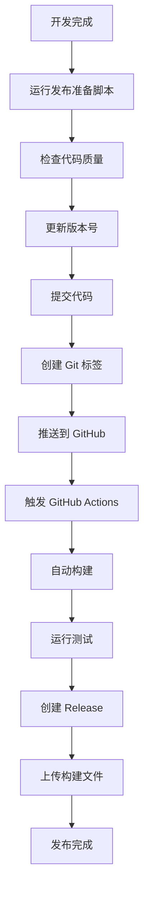

# 🚀 插件打包、安装和测试指南

## 📦 第一步：打包插件

### 1.1 安装依赖

```bash
# 确保你在项目根目录
cd obsidian-xmind-linker

# 使用 Bun 安装依赖
bun install

# 如果没有安装 Bun，可以先安装
curl -fsSL https://bun.sh/install | bash
```

### 1.2 构建插件

```bash
# 构建生产版本
bun run build

# 检查构建结果
ls -la main.js manifest.json styles.css
```

**构建成功后，你应该看到以下文件：**
- `main.js` - 插件主要逻辑
- `manifest.json` - 插件配置文件
- `styles.css` - 样式文件

## 🔧 第二步：安装到 Obsidian

### 2.1 找到 Obsidian 插件目录

**Windows:**
```
C:\Users\{用户名}\AppData\Roaming\obsidian\{库名}\.obsidian\plugins\
```

**macOS:**
```
/Users/{用户名}/Library/Application Support/obsidian/{库名}/.obsidian/plugins/
```

**Linux:**
```
~/.config/obsidian/{库名}/.obsidian/plugins/
```

### 2.2 创建插件目录

```bash
# 在你的 Obsidian 库中创建插件目录
mkdir -p /path/to/your-vault/.obsidian/plugins/xmind-linker
```

### 2.3 复制文件

```bash
# 复制构建好的文件到插件目录
cp main.js manifest.json styles.css /path/to/your-vault/.obsidian/plugins/xmind-linker/
```

**或者使用符号链接（推荐开发者）：**
```bash
# 创建符号链接，方便开发调试
ln -s /path/to/obsidian-xmind-linker /path/to/your-vault/.obsidian/plugins/xmind-linker
```

## ⚙️ 第三步：在 Obsidian 中启用插件

### 3.1 打开 Obsidian 设置

1. 打开 Obsidian
2. 点击左下角的设置图标 ⚙️
3. 或使用快捷键 `Ctrl+,` (Windows/Linux) 或 `Cmd+,` (Mac)

### 3.2 启用第三方插件

1. 在左侧菜单中找到 **"第三方插件"**
2. 如果显示 **"安全模式"** 已启用，点击 **"关闭安全模式"**
3. 点击 **"已安装插件"** 选项卡

### 3.3 找到并启用插件

1. 在插件列表中找到 **"XMind Viewer"**
2. 点击插件右侧的开关按钮启用
3. 插件状态应该显示为 **"已启用"**

## 🧪 第四步：测试插件功能

### 4.1 准备测试文件

首先，你需要一些 XMind 文件来测试：

1. **下载示例 XMind 文件**
   - 从 [XMind 官网](https://www.xmind.net/) 下载示例文件
   - 或者创建一个简单的思维导图并保存为 `.xmind` 格式

2. **将 XMind 文件放入 Obsidian 库**
   ```bash
   # 将 XMind 文件复制到你的 Obsidian 库中
   cp /path/to/your-xmind-file.xmind /path/to/your-vault/
   ```

### 4.2 测试基本功能

#### 测试 1：直接打开 XMind 文件
1. 在 Obsidian 文件浏览器中找到 `.xmind` 文件
2. 双击文件，应该会在新的标签页中打开 XMind 预览
3. 检查是否能看到思维导图内容

#### 测试 2：Markdown 嵌入功能
1. 创建一个新的 Markdown 文件
2. 输入以下内容：
   ```markdown
   # XMind 测试
   
   这是一个嵌入的 XMind 文件：
   
   ![[your-xmind-file.xmind]]
   
   应该能看到缩略图预览。
   ```
3. 切换到预览模式，检查是否显示缩略图

#### 测试 3：悬停提示功能
1. 在预览模式下，将鼠标悬停在嵌入的 XMind 文件上
2. 应该会显示操作提示菜单
3. 包含"预览"和"在 XMind 中打开"按钮

#### 测试 4：系统集成功能
1. 点击悬停菜单中的"在 XMind 中打开"
2. 应该会调用系统默认的 XMind 应用打开文件
3. （需要系统中安装了 XMind 应用）

### 4.3 测试插件设置

1. 打开 Obsidian 设置
2. 找到 **"插件选项"** → **"XMind Viewer"**
3. 测试各种设置选项：
   - 启用/禁用缩略图提取
   - 切换默认区域（全球/中国大陆）
   - 启用/禁用悬停提示
   - 启用/禁用系统集成

### 4.4 测试命令功能

1. 打开命令面板 `Ctrl+P` (Windows/Linux) 或 `Cmd+P` (Mac)
2. 搜索 "XMind" 相关命令：
   - **"打开 XMind 文件"**
   - **"提取 XMind 缩略图"**
   - **"清理缩略图缓存"**
3. 测试每个命令是否正常工作

## 🐛 第五步：故障排除

### 5.1 插件无法加载

**检查控制台错误：**
1. 在 Obsidian 中按 `Ctrl+Shift+I` (Windows/Linux) 或 `Cmd+Opt+I` (Mac)
2. 查看 Console 标签页是否有错误信息
3. 常见错误及解决方案：

```javascript
// 错误：找不到模块
// 解决：检查 node_modules 是否正确安装
bun install

// 错误：语法错误
// 解决：重新构建插件
bun run build
```

### 5.2 XMind 文件无法预览

**可能的原因和解决方案：**

1. **网络问题**
   ```bash
   # 检查网络连接，确保能访问 CDN
   curl -I https://unpkg.com/xmind-embed-viewer/dist/umd/xmind-embed-viewer.js
   ```

2. **文件格式问题**
   - 确保是有效的 XMind 文件
   - 尝试在 XMind 应用中打开文件验证

3. **权限问题**
   ```bash
   # 检查文件权限
   ls -la your-xmind-file.xmind
   ```

### 5.3 缩略图提取失败

**检查步骤：**
1. 确保 XMind 文件包含缩略图
2. 检查缓存目录权限
3. 查看控制台错误信息

```javascript
// 在控制台中手动测试
console.log('Testing thumbnail extraction...');
```

### 5.4 系统集成不工作

**检查项目：**
1. 确保系统中安装了 XMind 应用
2. 检查操作系统兼容性
3. 验证 Electron API 可用性

## 📋 第六步：完整测试清单

### ✅ 基本功能测试
- [ ] 插件成功加载
- [ ] 直接打开 XMind 文件
- [ ] Markdown 中嵌入 XMind 文件
- [ ] 缩略图正确显示
- [ ] 悬停提示菜单显示
- [ ] 点击预览按钮工作
- [ ] 系统集成功能工作

### ✅ 设置功能测试
- [ ] 插件设置面板可以打开
- [ ] 各种设置选项可以修改
- [ ] 设置保存后生效
- [ ] 重启 Obsidian 后设置保持

### ✅ 命令功能测试
- [ ] 所有命令都能在命令面板中找到
- [ ] 命令执行正常
- [ ] 命令快捷键工作（如果有）

### ✅ 错误处理测试
- [ ] 无效 XMind 文件的错误提示
- [ ] 网络错误的处理
- [ ] 权限错误的处理

## 🎯 第七步：性能测试

### 7.1 大文件测试
```bash
# 测试大型 XMind 文件（>10MB）
# 观察加载时间和内存使用
```

### 7.2 多文件测试
```bash
# 在一个 Markdown 文件中嵌入多个 XMind 文件
# 检查性能和稳定性
```

### 7.3 长时间使用测试
```bash
# 长时间使用插件，观察是否有内存泄漏
# 检查缓存清理是否正常工作
```

## 📊 第八步：生产环境部署

### 8.1 创建发布包

```bash
# 创建发布目录
mkdir release

# 复制必要文件
cp main.js manifest.json styles.css release/

# 创建压缩包
cd release
zip -r obsidian-xmind-linker-v1.0.0.zip .
```

### 8.2 版本管理

```bash
# 更新版本号
npm version patch

# 提交更改
git add .
git commit -m "Release v1.0.0"
git tag v1.0.0
git push origin main --tags
```

### 8.3 GitHub Release

1. 在 GitHub 仓库中创建新的 Release
2. 上传 `obsidian-xmind-linker-v1.0.0.zip`
3. 填写 Release Notes

## 📝 第九步：文档和支持

### 9.1 用户文档

创建用户友好的文档：
- 安装指南
- 使用教程
- 常见问题解答
- 故障排除指南

### 9.2 开发者文档

为其他开发者提供：
- API 文档
- 扩展指南
- 贡献指南
- 代码规范

---

## 🎉 恭喜！

如果你完成了以上所有步骤，你的 Obsidian XMind Viewer 插件应该已经成功安装并可以正常使用了！

**遇到问题？**
- 检查控制台错误信息
- 查看 GitHub Issues
- 联系开发者获取支持

**想要贡献？**
- Fork 仓库
- 提交 Pull Request
- 报告 Bug 或建议新功能

# XMind Linker 部署指南

本文档详细说明了 XMind Linker 插件的部署和发布流程。

## 🚀 自动化发布流程

### 概述

项目使用 GitHub Actions 实现自动化构建和发布，通过创建 Git 标签触发发布流程。

### 发布流程架构



## 📋 发布步骤

### 方式一：使用自动化脚本（推荐）

1. **运行发布准备脚本**
   ```bash
   ./scripts/prepare-release.sh 1.0.1
   ```

2. **脚本会自动执行以下操作**：
   - 检查 Git 状态和分支
   - 验证版本号格式
   - 运行测试和构建
   - 更新版本文件
   - 生成更新日志
   - 可选：自动提交和推送

3. **查看发布进度**
   - 访问 GitHub Actions 页面查看构建状态
   - 发布完成后检查 GitHub Releases

### 方式二：手动发布

1. **准备发布**
   ```bash
   # 确保代码已提交
   git status
   
   # 切换到 main 分支
   git checkout main
   
   # 拉取最新代码
   git pull origin main
   ```

2. **运行测试和构建**
   ```bash
   # 安装依赖
   bun install
   
   # 运行测试
   bun test
   
   # 构建项目
   bun run build
   ```

3. **更新版本号**
   ```bash
   # 手动更新 package.json 中的版本号
   # 然后运行版本更新脚本
   export npm_package_version=1.0.1
   node version-bump.mjs
   ```

4. **提交和标签**
   ```bash
   # 提交版本更新
   git add .
   git commit -m "chore: bump version to 1.0.1"
   
   # 创建标签
   git tag v1.0.1
   
   # 推送代码和标签
   git push origin main
   git push origin v1.0.1
   ```

## 🔧 GitHub Actions 工作流

### 发布工作流 (`.github/workflows/release.yml`)

**触发条件**: 推送 Git 标签时自动触发

**主要功能**:
- 🏗️ 自动构建插件
- 🧪 运行测试验证
- 📦 打包发布文件
- 📝 生成发布说明
- 🚀 创建 GitHub Release
- 📁 上传构建产物

**发布产物**:
- `xmind-linker-{version}.zip` - 完整插件包
- `main.js` - 主要代码文件
- `manifest.json` - 插件清单
- `styles.css` - 样式文件

### 构建测试工作流 (`.github/workflows/build.yml`)

**触发条件**: 推送到 main/develop 分支或创建 PR 时

**主要功能**:
- ✅ 代码质量检查
- 🧪 运行单元测试
- 🏗️ 构建验证
- 🔒 安全性扫描
- 📊 上传构建产物

## 📝 版本管理

### 版本号规范

采用语义化版本控制 (Semantic Versioning):
- **MAJOR.MINOR.PATCH** (例如: 1.0.1)
- **MAJOR**: 不兼容的 API 修改
- **MINOR**: 向下兼容的功能性新增
- **PATCH**: 向下兼容的问题修正

### 版本文件

项目中涉及版本号的文件:
- `package.json` - Node.js 包版本
- `manifest.json` - Obsidian 插件清单
- `versions.json` - 版本兼容性映射

### 自动版本更新

`version-bump.mjs` 脚本会自动：
1. 从 `package.json` 读取新版本号
2. 更新 `manifest.json` 中的版本
3. 在 `versions.json` 中添加版本映射

## 🎯 发布检查清单

### 发布前检查

- [ ] 所有测试通过
- [ ] 代码已经过 review
- [ ] 文档已更新
- [ ] 版本号符合规范
- [ ] 更新日志已准备
- [ ] 没有未提交的更改

### 发布后验证

- [ ] GitHub Release 创建成功
- [ ] 发布文件完整且可下载
- [ ] 版本号正确显示
- [ ] 发布说明准确完整
- [ ] 插件可正常安装和使用

## 🔍 故障排除

### 常见问题

#### 1. GitHub Actions 构建失败

**可能原因**:
- 测试失败
- 构建错误
- 依赖问题

**解决方案**:
```bash
# 本地复现问题
bun install
bun test
bun run build

# 检查错误日志
# 修复问题后重新推送标签
git tag -d v1.0.1
git push origin :refs/tags/v1.0.1
git tag v1.0.1
git push origin v1.0.1
```

#### 2. 版本号冲突

**可能原因**:
- 标签已存在
- 版本号格式错误

**解决方案**:
```bash
# 检查现有标签
git tag -l

# 删除错误标签
git tag -d v1.0.1
git push origin :refs/tags/v1.0.1

# 使用正确版本号
git tag v1.0.2
git push origin v1.0.2
```

#### 3. 权限问题

**可能原因**:
- GitHub Token 权限不足
- 仓库设置问题

**解决方案**:
- 检查仓库的 Actions 权限设置
- 确认 GITHUB_TOKEN 有写入权限
- 检查分支保护规则

### 调试命令

```bash
# 检查 Git 状态
git status
git log --oneline -10

# 检查标签
git tag -l
git show v1.0.1

# 检查远程仓库
git remote -v
git ls-remote --tags origin

# 本地构建测试
bun install
bun test
bun run build
ls -la dist/
```

## 📊 发布统计

### 发布频率建议

- **补丁版本**: 每 1-2 周
- **次要版本**: 每 1-2 月
- **主要版本**: 每 6-12 月

### 发布时机

- **工作日**: 周二至周四
- **时间**: 上午 10:00 - 下午 4:00 (UTC+8)
- **避免**: 节假日和周末

## 🔗 相关链接

- [GitHub Actions 文档](https://docs.github.com/en/actions)
- [Obsidian 插件开发指南](https://docs.obsidian.md/Plugins/Getting+started/Build+a+plugin)
- [语义化版本控制](https://semver.org/lang/zh-CN/)
- [Bun 文档](https://bun.sh/docs)

## 📞 支持

如果在发布过程中遇到问题：

1. 查看 [GitHub Issues](../../issues)
2. 检查 [GitHub Actions 日志](../../actions)
3. 参考 [故障排除](#故障排除) 部分
4. 联系项目维护者

---

**最后更新**: 2024-01-XX  
**维护者**: Leafney 