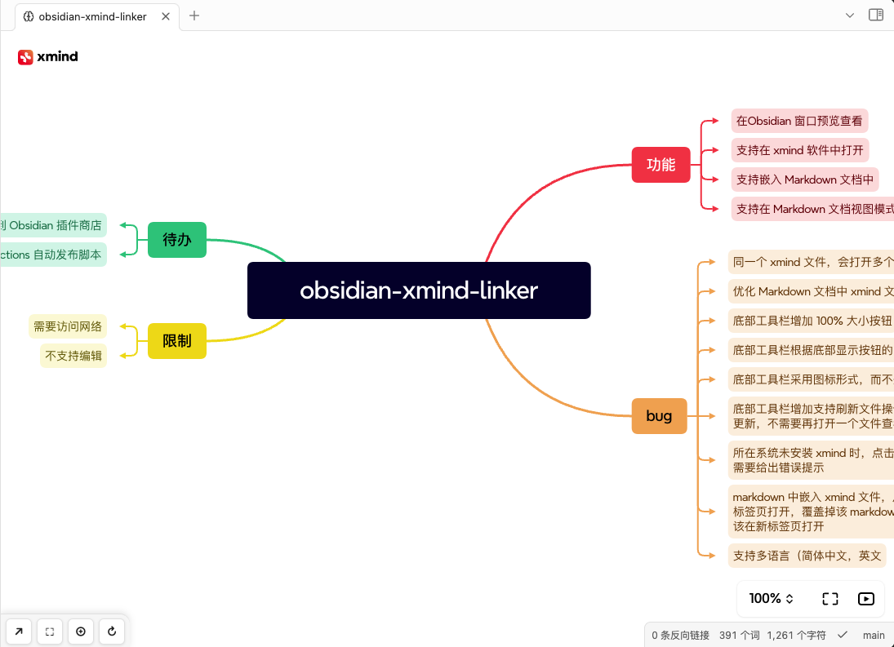
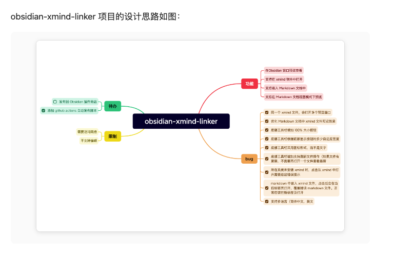

# XMind Linker 功能特性

## 📸 功能展示

### 1. 直接查看 XMind 文件

**功能说明：**
- 在 Obsidian 中双击 `.xmind` 文件即可直接打开查看
- 支持完整的交互功能：缩放、平移、导航
- 保持原有的思维导图结构和样式
- 实时响应式设计，适配不同窗口大小

**技术特点：**
- 基于 XMind 官方嵌入式查看器
- 无需安装额外软件即可查看
- 支持所有 XMind 格式的思维导图
- 流畅的用户体验和快速加载

### 2. Markdown 中嵌入 XMind 文件

**功能说明：**
- 使用简单的 `![[filename.xmind]]` 语法在笔记中嵌入思维导图
- 自动提取缩略图进行预览显示
- 点击缩略图可打开完整的查看器
- 支持悬停显示操作菜单

**使用场景：**
- 项目文档中嵌入项目架构图
- 学习笔记中插入知识结构图
- 会议记录中包含讨论要点图
- 任何需要可视化思维的场景

## 🔧 核心功能

### 文件关联
- **自动识别**：Obsidian 自动识别 `.xmind` 文件格式
- **双击打开**：直接双击文件即可在插件中查看
- **标签管理**：支持在新标签页中打开，避免重复

### 查看体验
- **完整功能**：支持缩放、平移、节点展开/折叠
- **响应式设计**：自适应窗口大小变化
- **加载优化**：智能加载进度显示
- **错误处理**：友好的错误提示和恢复机制

### 嵌入功能
- **Markdown 语法**：标准的 `![[]]` 语法支持
- **缩略图提取**：自动生成高质量缩略图
- **智能缓存**：缩略图缓存机制，提升加载速度
- **批量处理**：支持一次性处理多个文件

### 系统集成
- **外部编辑**：一键在 XMind 软件中打开编辑
- **跨平台支持**：Windows、macOS、Linux 全平台
- **文件同步**：编辑后自动刷新显示
- **权限处理**：智能处理系统权限问题

## 🎯 使用场景

### 知识管理
- **学习笔记**：在笔记中嵌入知识结构图
- **项目文档**：项目架构和流程图展示
- **研究资料**：研究思路和方法整理

### 团队协作
- **会议记录**：会议讨论要点可视化
- **项目规划**：项目计划和时间线展示
- **头脑风暴**：创意和想法的结构化展示

### 个人效率
- **任务管理**：任务分解和优先级管理
- **目标规划**：个人和职业目标规划
- **学习计划**：学习路径和进度跟踪

## 🚀 技术优势

### 性能优化
- **按需加载**：只在需要时加载查看器库
- **智能缓存**：缩略图和资源缓存机制
- **内存管理**：正确的资源清理和内存释放
- **并发控制**：避免重复加载和资源冲突

### 用户体验
- **无缝集成**：与 Obsidian 界面完美融合
- **快速响应**：优化的加载和渲染速度
- **错误恢复**：智能的错误处理和重试机制
- **多语言支持**：中英文界面自动切换

### 兼容性
- **格式支持**：支持所有 XMind 文件格式
- **版本兼容**：兼容不同版本的 XMind 文件
- **平台适配**：跨操作系统平台支持
- **插件生态**：与其他 Obsidian 插件良好兼容

## 📈 未来规划

### 功能扩展
- [ ] 支持更多思维导图格式
- [ ] 添加编辑功能（基础编辑）
- [ ] 支持导出为图片格式
- [ ] 添加全文搜索功能

### 性能优化
- [ ] 进一步优化加载速度
- [ ] 支持大文件的渐进式加载
- [ ] 优化内存使用
- [ ] 添加离线缓存功能

### 用户体验
- [ ] 更丰富的自定义选项
- [ ] 主题适配优化
- [ ] 快捷键支持
- [ ] 更好的移动端支持

---

**XMind Linker** 致力于为 Obsidian 用户提供最佳的思维导图集成体验，让知识管理更加高效和直观。 